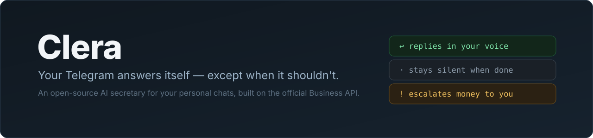
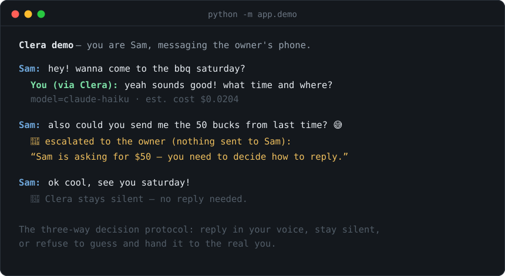

<div align="center">



[](https://github.com/ebarkhordar/clera/actions/workflows/ci.yml)
[](https://github.com/ebarkhordar/clera/releases)
[](LICENSE)
[](https://www.python.org/)
[](https://github.com/astral-sh/ruff)

**[Try the demo](#-try-it-in-30-seconds)** · [Quick start](#quick-start) · [How it works](#how-it-works) · [Contributing](#-contributing) · [Platform vision](docs/PLATFORM.md)

</div>

---

There are moments when you don't have the energy to answer messages — but leaving
people on read feels worse. **Clera is an AI secretary for your personal
Telegram.** It connects through the official
[Business API](https://core.telegram.org/bots/features#secretary-bots) (no
userbot), reads your real one-to-one chats, and for every incoming message makes
one of three decisions:

| Decision | What happens |
| --- | --- |
| ↩️ **Reply** | Sends a response *as you* — same language, same tone, grounded in your full history with that contact |
| 🤫 **Stay silent** | Nothing — the conversation ended, or you're clearly handling it yourself |
| 👋 **Escalate** | Pings you privately: money, commitments, or facts only you know are **never guessed at** |

<div align="center">

</div>

## ✨ What it does

- 🗣️ **Learns your voice per relationship** — formal with your doctor, slang with
  your friends, Persian with your family; real exchange pairs from each thread
  are the model's ground truth
- 🎙️ **Hears voice notes** (transcribed locally on-device) and 🖼️ **sees photos**
- 📚 **Imports years of history** from a Telegram Desktop export in one command
- 🎛️ **Controlled from Telegram**: `/status` `/auto` `/review` `/pause`
  `/mute` + a daily digest of every decision
- 🔒 **Trust by staging**: starts recording-only, then approve-every-draft, then
  automatic — you promote it when it's earned it
- 🏠 **Self-hosted**: one process, one SQLite file, no public URL; Docker /
  systemd / launchd recipes included

## ⚡ Try it in 30 seconds

No bot, no Telegram account, no API key — the demo runs the real decision
pipeline in your terminal, with you playing the contact:

```bash
git clone https://github.com/ebarkhordar/clera && cd clera
python -m venv .venv && source .venv/bin/activate && pip install -r requirements.txt
python -m app.demo
```

Ask to hang out — it answers in the owner's voice. Ask for the $50 from last
week — it refuses to guess and escalates to the owner. That's the product.

---

## How it works

```
A contact messages you
        │  business_message update (text · voice → local transcript · photo → description)
        ▼
   Policy gate ───────────► enabled · not paused · active hours · not muted · allowlist
        │
        ▼
   Agent reads thread history + durable contact profile, then decides:
        │
        ├── reply    ──► sent as you via business_connection_id
        ├── silent   ──► nothing
        └── escalate ──► "this one needs you" in your control chat
        │
        ▼
   Activity log ──► /status counts · daily digest
```

Two properties make the replies convincing and safe:

- **Per-contact memory.** Every message in a covered chat is stored — including what *you*
  type, which is how Clera learns your voice per relationship (formal with your doctor,
  casual with your friends, a different language with your family). A durable profile per
  contact is maintained by the model and rebuilt as conversations evolve.
- **Escalation instead of guessing.** The system prompt forbids invented facts, prices,
  times, and commitments. When answering would require any of those, the agent doesn't
  reply — you get a private note instead.

## Requirements

| | |
| --- | --- |
| Python | 3.12+ |
| Bot token | Free, from [@BotFather](https://t.me/BotFather) |
| Telegram Premium | Required on the account you connect (Business connections are a Premium feature) |
| `ANTHROPIC_API_KEY` | Optional — enables replies. Without it Clera never auto-sends; it records and escalates only |
| Apple Silicon | Optional — enables local voice-note transcription (`requirements-voice.txt`) |

## Quick start

```bash
git clone https://github.com/ebarkhordar/clera && cd clera
python -m venv .venv && source .venv/bin/activate
pip install -r requirements.txt

cp .env.example .env        # set TELEGRAM_BOT_TOKEN (and ANTHROPIC_API_KEY when ready)
python -m app.doctor        # pre-flight: validates token, config, and reply backend
python -m app.main          # long-polling — no public URL needed
```

Then connect the bot to your account in the Telegram app:
**Settings → Business → Chatbots → select your bot**, grant reply permission, and choose
which chats it covers. Send `/start` to the bot for a live setup checklist.

A full walkthrough against a live account is in [docs/LIVE_TEST.md](docs/LIVE_TEST.md).

## Recommended rollout

Trust is earned in stages; each stage is one command.

1. **Import your history** *(optional but transformative)* — export your chats from
   Telegram Desktop (*Settings → Advanced → Export Telegram data*, JSON) and run
   `python -m app.import_export result.json`. Years of conversations become the
   secretary's memory in one shot; re-running is safe (duplicates are skipped).
2. **Collect** — run with `COLLECT_ONLY=true` for a few days. Clera records every covered
   message (voice included) and does nothing else: no LLM calls, no replies, no cost.
3. **Backfill** — `python -m app.backfill` builds a profile for every contact from the
   collected history, so the secretary starts each thread fully informed.
4. **Review** — restart without the flag. Every proposed reply arrives in your control chat
   with **Send / Discard** buttons; nothing goes out without your tap.
5. **Automatic** — when the drafts consistently sound like you, send `/auto`. From then on
   replies go out on their own, escalations come to you, and the daily digest shows you
   everything it did. `/review` or `/pause` at any time.

## Owner commands

All control happens inside Telegram, in your private chat with the bot:

| Command | Effect |
| --- | --- |
| `/status` | Mode, reply permission, last-24h decisions, spend, muted contacts |
| `/auto` | Automatic mode — reply without approval, escalate what needs you |
| `/review` | Review mode — every reply waits for your tap |
| `/pause` / `/resume` | Stop/start acting; recording always continues |
| `/mute <name>` / `/unmute <name>` | Never act in a specific chat |
| `/digest` | On-demand activity summary (also sent daily at `DIGEST_HOUR`) |

Forwarding any voice note to the bot returns its transcript.

## Configuration

Everything is environment-driven (loaded from `.env`; see
[`.env.example`](.env.example) for the complete annotated list).

| Variable | Default | Description |
| --- | --- | --- |
| `TELEGRAM_BOT_TOKEN` | — | Bot token (platform mode: the manager bot's token) |
| `ANTHROPIC_API_KEY` | — | Enables Claude replies; without it nothing is ever auto-sent |
| `COLLECT_ONLY` | `false` | Record everything, act on nothing, zero LLM calls |
| `DEFAULT_TIER` | `fast` | Model tier: `fast` (cheap) or `best` |
| `DIGEST_HOUR` | `21` | Local hour for the daily digest; `-1` disables |
| `STALE_AFTER_SECONDS` | `300` | Never answer backlog messages older than this |
| `NOTIFY_AUTO_REPLIES` | `true` | Echo each auto-sent reply to your control chat |
| `STORE_BACKEND` | `sqlite` | `sqlite` (persistent) or `memory` (tests) |
| `COST_MARKUP` | `2.5` | Multiplier on raw token cost in the per-reply estimate |

## Deployment

Clera is a single long-polling process — no webhook, no reverse proxy, no public URL.
Recipes for all three targets are in [docs/DEPLOY.md](docs/DEPLOY.md):

- **macOS** — launchd job (`deploy/com.clera.secretary.plist`); survives reboots, local
  voice transcription works
- **Linux** — systemd unit (`deploy/clera.service`)
- **Docker** — `docker build -t clera . && docker run --env-file .env -v clera-data:/clera/data clera`

A file lock (`data/clera.lock`) guarantees a single instance: a second poller on the same
token would silently split the update stream, so Clera refuses to start instead.

## Safety model

Sending messages as a real person is high-stakes. The defaults are deliberately conservative:

- **Nothing is sent without an LLM actually deciding to reply.** Placeholder output (no API
  key, provider failure) is never delivered — it escalates to you.
- **Money, contracts, and commitments always escalate.** Enforced in the system prompt and
  favored by the decision protocol: when in doubt, notify rather than guess.
- **Never talks over you.** If you answered a message yourself while a reply was being
  generated, the reply is dropped.
- **Stale backlog is never answered.** Messages queued while the process was down are
  recorded as history only — no day-late replies into conversations that moved on.
- **Review mode and `/pause` are always one command away**, per connection; `/mute` per
  contact.

## Privacy

Clera stores the message content of your covered chats in a local SQLite database
(`data/clera.db`) — that history *is* the product's memory, and it lives entirely on your
machine. No data leaves your host except the prompts sent to your configured LLM provider.
Treat the database and `.env` (bot token, API key) as secrets; both are gitignored. Data
retention and deletion tooling is on the roadmap and required before any hosted offering —
see [docs/PLATFORM.md](docs/PLATFORM.md).

## Architecture

```
app/
  main.py          Entrypoint: handler wiring, single-instance lock, digest scheduler
  platform.py      Experimental multi-tenant runtime (manager bot + fleet)
  doctor.py        Pre-flight connectivity and configuration check
  backfill.py      Build contact profiles from collected history
  digest.py        Daily activity digest (pure renderer + scheduler)
  config.py        Environment-driven settings
  handlers/
    business.py    Core: business messages → record → policy → agent → act
    control.py     Owner commands, draft approval, voice-note transcripts
    managed.py     Managed-bot provisioning (creation link, getManagedBotToken)
  agent/
    secretary.py   Draft replies + contact profiles; reply/silent/notify protocol
    prompts.py     Voice-matching and safety prompts
    transcribe.py  Local voice transcription (mlx-whisper, ffmpeg-free)
    vision.py      Photo description (Claude vision)
    providers/     Pluggable LLM backends (Anthropic API, Claude CLI)
  policy/          Engagement rules: enabled, paused, hours, allowlist, staleness
  billing/         Token pricing and per-reply cost estimates
  store/           SQLite (with migrations) / in-memory, behind one small API
```

Storage backends and LLM providers are both swappable behind small interfaces; Postgres or
another provider drop in without touching call sites.

## Platform mode (experimental)

The long-term direction is a hosted platform where a non-technical user gets their own
secretary bot in a few taps and pays per usage. The building blocks already work:

```bash
python -m app.platform   # manager bot + one secretary runner per managed bot
```

The manager bot provisions a personal bot per client via Telegram's managed-bots flow
(the client owns the bot; the platform operates it via `getManagedBotToken`). Webhook
ingestion, Telegram Stars billing, and a settings Mini App are the remaining pieces —
design and status in [docs/PLATFORM.md](docs/PLATFORM.md).

## Development

```bash
pip install -r requirements.txt ruff pre-commit
pre-commit install

ruff check . && ruff format --check .
pytest -q
```

CI runs Ruff, the test suite, and a [gitleaks](https://github.com/gitleaks/gitleaks) secret
scan on every push and pull request ([`.github/workflows/ci.yml`](.github/workflows/ci.yml)).
The design rationale lives in [docs/DESIGN.md](docs/DESIGN.md).

## Roadmap

- Webhook gateway for the multi-tenant platform
- Telegram Stars billing (prepaid, pay-per-usage)
- Settings Mini App
- Data retention and deletion controls
- Postgres backend; encrypted storage for tokens and messages

Full backlog and platform design: [docs/PLATFORM.md](docs/PLATFORM.md).

## Security

Please report vulnerabilities privately — see [SECURITY.md](SECURITY.md). This project
handles private messages and access tokens: never commit secrets, keep them in the
gitignored `.env`.

## 🤝 Contributing

This project wants a community, and it's built to be easy to join: the codebase
is small and readable, almost everything runs **without any secrets** (in-memory
store + placeholder provider + `python -m app.demo`), and the test suite runs in
under a second.

Where help is most wanted right now:

- 🐧 [Linux voice transcription via faster-whisper](https://github.com/ebarkhordar/clera/issues/2) — `good first issue`
- 🤖 [OpenAI-compatible provider (covers Ollama/vLLM)](https://github.com/ebarkhordar/clera/issues/4) — `good first issue`
- 🐘 [Postgres store backend](https://github.com/ebarkhordar/clera/issues/3)
- 🎙️ [Transcribe exported voice files retroactively](https://github.com/ebarkhordar/clera/issues/5)

Read [CONTRIBUTING.md](CONTRIBUTING.md) first — it explains the safety
invariants every PR in the message path must preserve. For bigger ideas, open an
issue; the design docs ([DESIGN.md](docs/DESIGN.md),
[PLATFORM.md](docs/PLATFORM.md)) show where the project is headed.

## License

[MIT](LICENSE).
